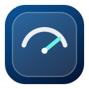

# Meter

Meter is a small native macOS menu bar app that shows your Mac's current download and upload traffic. It updates once per second and uses the active network interface's byte counters. It does **not** run an internet speed test.



## Features

- Live download (↓) and upload (↑) rates in the macOS menu bar.
- A Liquid Glass details panel showing both rates and the active interface.
- Optional launch at login.
- No account, network request, or special macOS permission is required.

Rates use decimal units: `1 KB/s = 1,000 bytes/s`, `1 MB/s = 1,000 KB/s`. Meter shows traffic handled by the active interface, which may include local network traffic. VPNs can change which interface macOS reports as primary.

## Requirements

- macOS 26 or later.
- Xcode 26 or later for building from source. The project is currently developed and tested with Xcode 27.

## Install

Download `Meter-v1.0.0-macos.dmg` from [Releases](https://github.com/sam-a1a/Meter/releases), open it, and drag `Meter.app` to Applications. A zip archive is also available. Open the app; its rates appear in the menu bar near the clock and Wi-Fi controls. Click the rates for details and preferences.

The downloadable build is ad hoc signed and **not notarized** because this project does not have an Apple Developer ID certificate. macOS may block a downloaded copy. Building locally in Xcode is the most reliable installation path until a notarized release is available.

## Build from source

1. Clone this repository.
2. Open `Meter.xcodeproj` in Xcode.
3. Select the `Meter` scheme and **My Mac** as the destination, then press Run.

The Xcode project is checked in. If you change `project.yml`, run `xcodegen generate` to regenerate it.

For command line verification:

```sh
xcodebuild -project Meter.xcodeproj -scheme Meter -destination 'platform=macOS' CODE_SIGNING_ALLOWED=NO test
```

To create the release downloads locally, run `scripts/package.sh`. It writes a DMG, a zip, and SHA-256 checksums to `dist/`.

## How it works

Meter reads the active interface's received and sent byte totals through macOS system APIs. It divides the difference between consecutive samples by the elapsed time, then formats the result as KB/s, MB/s, or GB/s. A connection or interface change starts a fresh sample so old totals do not appear as a spike.

## Development

Work is tracked in [GitHub issues](https://github.com/sam-a1a/Meter/issues) and the [Meter development board](https://github.com/users/sam-a1a/projects/1). Changes land through pull requests, and GitHub Actions runs the build and tests.
